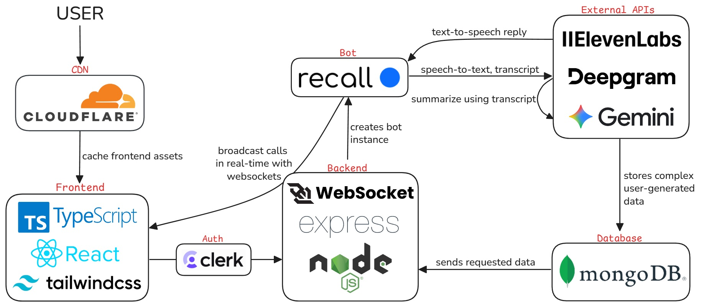

# SayLess

## Table of Contents

1. [Overview](#overview)  
2. [Features](#features)  
3. [Technologies Used](#technologies-used)
4. [Installation](#installation)  
   - [Prerequisites](#prerequisites)
   - [Setup](#setup)
5. [Images](#images)  

## Overview

SayLess is an AI-powered meeting assistant that joins real-time meetings, speaks naturally in a chosen voice, and actively participates in conversations. It can listen, respond when needed, and automatically generate transcripts, summaries, and notes for every meeting.

## Features

- Real-time meeting transcription
- customizable AI voice text-to-speech
- AI summary

## Technologies Used

- **Frontend**: TypeScript, React.js, Tailwind CSS
- **Backend**: Node.js, Express.js, WebSockets (real-time meeting broadcast)
- **Database**: MongoDB (for user-generated data)
- **External APIs**: 
    - Recall (join meetings)
    - ElevenLabs (text-to-speech)
    - Deepgram (speech-to-text, transcripts)
    - Google Gemini (generating summaries)
- **Other**: Cloudflare (for CDN), Clerk (for authentication)

## Installation

To run the project locally, follow these steps:

### Prerequisites

Before installing, ensure you have:

- Node.js
- npm or yarn
- MongoDB account (for database)
- API keys for: 
  - Clerk
  - Deepgram 
  - ElevenLabs  
  - Google Gemini  
  - Recall

### Setup

1. Clone the repository:
    - ```git clone``` 
    - ```cd``` into repository 

2. Set up MongoDB and ```.env``` variables in both ```frontend``` and ```backend```

3. Install dependencies and run:
    ```bash
    cd backend
    npm install
    npm run dev
    ```
    ```bash
    cd frontend
    npm install
    npm run dev

## Images

### System Architecture Diagram

